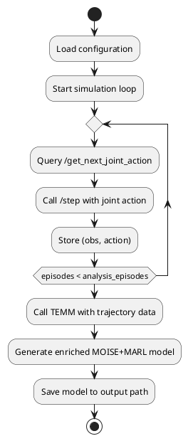

# Component Specification: Analyzer

## Overview
The `Analyzer` component in CybMASDE is responsible for post-training analysis of agent behavior. It generates new trajectories using the trained joint policy in a simulated environment and extracts meaningful organizational patterns from these trajectories using the TEMM framework.

It helps to evaluate the conformity and explainability of the agents’ behavior with respect to roles and goals defined (or emerging) during training.

---

## Responsibilities
- Query the latest policy via the `joint policy tester`.
- Simulate trajectories using the `ODF exposer`.
- Feed simulated trajectories into `TEMM` for organizational analysis.
- Output a refined or enriched `MOISE+MARL model` including inferred roles and goals.

---

## Configuration Parameters
| Parameter                   | Type    | Description |
|-----------------------------|---------|-------------|
| `policy_tester_url`         | string  | URL to access the joint policy tester. |
| `odf_exposer_url`           | string  | URL to simulate the environment via ODF. |
| `temm_path`                 | string  | Path to the TEMM executable or module. |
| `analysis_episodes`         | int     | Number of simulated episodes to generate. |
| `output_model_path`         | string  | Path to store the enriched MOISE+MARL model. |
| `logging_level`             | string  | Logging verbosity. |

---

## External Interfaces

### Consumes
| Method | Endpoint                  | Description |
|--------|---------------------------|-------------|
| POST   | `/get_next_joint_action` | Get actions from the joint policy tester. |
| POST   | `/step` (ODF exposer)     | Simulate next observation in the environment. |

### Produces
| Output File | Description |
|-------------|-------------|
| `enriched_model.yaml` | Refined MOISE+MARL model with inferred structure. |

---

## Internal Logic

### Key Methods
| Function | Description |
|----------|-------------|
| `simulate_trajectories()` | Runs policy in ODF simulator to generate episodes. |
| `analyze_trajectories()` | Uses TEMM to extract roles/goals from generated data. |
| `save_model()` | Persists the enriched organizational model to disk. |

### Activity Diagram (PlantUML)

---

## Startup Behavior
- Load configuration.
- Initialize policy access and simulator endpoint.
- Prepare temporary directory or data buffer for trajectories.

---

## Shutdown Behavior
- Gracefully finish current episode.
- Ensure all collected data is flushed to file.
- Save generated organizational model.

---

## Error Handling
- Retries policy or simulation queries on failure.
- Logs analysis errors or inconsistencies.
- Reports if model generation fails.

---

## Notes
- This component is designed to work independently after training is complete.
- It complements initial MOISE+ definitions by extracting emergent behavior.
- Useful both for validation and for policy iteration.

---

## Next Steps
- Define exact trajectory format used by TEMM.
- Provide example analysis scenarios (Overcooked, CyberDefense, etc.).
- Add CLI wrapper for stand-alone execution of the analyzer.

