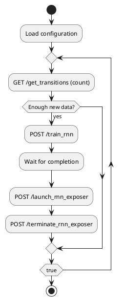

# Component Specification: Modeller

## Overview
The `Modeller` component in CybMASDE is responsible for building and maintaining a predictive model of the environment dynamics, referred to as the **Observational Dynamics Function (ODF)**. This model enables simulation-based training and analysis by learning how the environment responds to joint actions.

The ODF model is built using two complementary sources:
- An **exact-but-partial** database of transitions (collected from the real world).
- A **general-but-approximate** neural model (RNN).

The `Modeller` coordinates these data sources and exposes them via the `ODF exposer` service.

---

## Responsibilities
- Retrieve new transitions from the `ODF DB`.
- Monitor for a sufficient number of new transitions to trigger training.
- Launch a temporary training job to update the RNN model.
- Replace the `ODF RNN exposer` once the new model is ready.
- Serve updated predictions via the `ODF exposer` API (indirectly).

---

## Configuration Parameters
| Parameter               | Type    | Description |
|-------------------------|---------|-------------|
| `odf_db_manager_url`    | string  | URL to access transition database manager. |
| `rnn_manager_url`       | string  | URL to start/monitor RNN training jobs. |
| `exposer_control_url`   | string  | Endpoint to control the swap of RNN exposers. |
| `training_threshold`    | int     | Number of new transitions required to trigger a retraining. |
| `check_interval_sec`    | int     | How often to check if retraining is needed. |
| `logging_level`         | string  | Log verbosity. |
| `max_training_runtime`  | int     | Max duration (sec) allowed for one training job. |

---

## External Interfaces

### Consumes
| Method | Endpoint                    | Description |
|--------|-----------------------------|-------------|
| GET    | `/get_transitions`          | Fetches transition data from ODF DB. |
| POST   | `/train_rnn`                | Triggers RNN training on recent transitions. |
| POST   | `/launch_rnn_exposer`       | Spawns new exposer instance with latest model. |
| DELETE | `/terminate_rnn_exposer`    | Stops the previous RNN exposer instance. |

---

## Internal Logic

### Key Methods
| Function | Description |
|----------|-------------|
| `check_training_need()` | Compares transition count to last checkpoint. |
| `start_training_job()` | Sends training request to RNN manager. |
| `deploy_new_exposer()` | Launches new exposer with updated model. |
| `retire_old_exposer()` | Deactivates the old one after switchover. |
| `monitor_loop()` | Periodically checks for training conditions and performs updates. |

### Activity Diagram (PlantUML)

---

## Startup Behavior
- Load parameters from config or env.
- Initialize state (last transition ID/checkpoint).
- Start `monitor_loop()`.

---

## Shutdown Behavior
- Graceful shutdown of monitor thread.
- Optionally flush logs or save last checkpoint state.

---

## Error Handling
- Retries RNN training if it fails.
- Logs and alerts if new exposer fails to load.
- Times out and skips faulty transitions or training jobs.

---

## Notes
- Must be robust to concurrent access to the DB.
- Should log model versions and swap events.
- Designed for long-running execution within a container or service pod.

---

## Next Steps
- Define data format for transitions and checkpoints.
- Implement monitoring metrics (number of transitions, training time, etc.).
- Add test mode to simulate training and swap logic.

