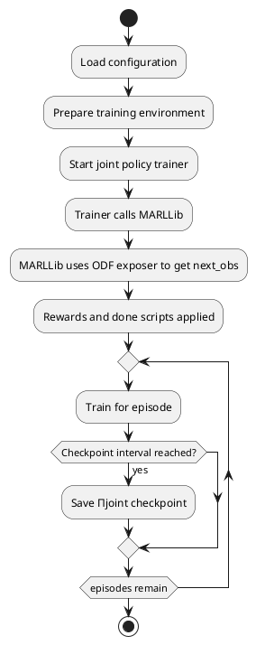

# Component Specification: Trainer

## Overview
The `Trainer` component in CybMASDE is responsible for launching and managing the training process of the joint policy using a MARL algorithm. Rather than performing training itself, it orchestrates the execution of a training script (`joint policy trainer`) that uses an environment instantiated via `MARLLib` and powered by the `ODF exposer` for simulation.

The training is guided by organizational constraints (from the MOISE+MARL model), and periodically stores policy checkpoints. These are used by the `joint policy exposer` and `joint policy tester` components.

---

## Responsibilities
- Start the `joint policy trainer` with proper parameters and environment setup.
- Ensure access to the ODF simulation via `ODF exposer`.
- Ensure the MARL environment includes constraints from the MOISE+MARL model.
- Monitor training process, logs, and status.

---

## Configuration Parameters
| Parameter                | Type    | Description |
|--------------------------|---------|-------------|
| `trainer_script_path`    | string  | Path to the training script that invokes MARLLib. |
| `moise_model_path`       | string  | Path to the MOISE+MARL specification file. |
| `odf_exposer_url`        | string  | URL for querying next observation predictions. |
| `reward_script_path`     | string  | Path to the reward function script. |
| `done_script_path`       | string  | Path to the done condition script. |
| `training_episodes`      | int     | Number of training episodes per session. |
| `checkpoint_interval`    | int     | Interval (episodes) at which policy is checkpointed. |
| `logging_level`          | string  | Logging verbosity level. |

---

## External Interfaces

### Consumes
| Method | Endpoint                 | Description |
|--------|--------------------------|-------------|
| POST   | `odf_exposer/step`       | Used by the environment to simulate transitions. |

---

## Internal Logic

### Key Methods
| Function | Description |
|----------|-------------|
| `launch_training()` | Starts the training script with all required paths and arguments. |
| `monitor_training()` | Periodically monitors training logs and progress. |
| `prepare_env()` | Prepares MARLLib wrapper with access to ODF and constraints. |

### Activity Diagram (PlantUML)

---

## Startup Behavior
- Load configuration from disk or environment.
- Prepare temporary execution context for training.
- Start training script (`joint policy trainer`).

---

## Shutdown Behavior
- Allow the training to finish current episode.
- Optionally interrupt training cleanly and store partial checkpoint.

---

## Error Handling
- Retries training launch on failure.
- Logs incomplete episodes or broken interactions with ODF.
- Alerts if training does not progress after several cycles.

---

## Notes
- The `Trainer` itself is stateless; all state is handled by `joint policy trainer` and the MARLLib engine.
- Reward and termination conditions are fully customizable by the designer.
- Designed for continuous operation with periodic retraining and re-deployment.

---

## Next Steps
- Define interface between MARLLib and ODF exposer.
- Provide templates for reward and done scripts.
- Add monitoring tools to track training metrics (loss, reward, etc.).

