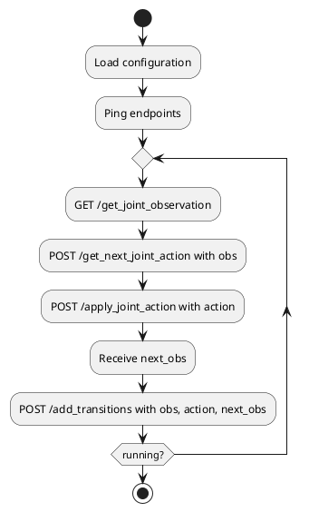

# Component Specification: Policy Transferer

## Overview
The `Policy Transferer` is a core component of the CybMASDE framework. It serves as the live connector between the trained joint policy and the real-world environment. It collects observations from the environment, computes actions using the latest policy, applies these actions to the environment, and logs the resulting transitions.

It ensures uninterrupted service by operating continuously, and pushing transitions into the system for modeling and learning.

---

## Responsibilities
- Periodically collect joint observations from the real environment.
- Query the latest joint policy to obtain joint actions.
- Apply joint actions to the real environment.
- Record transitions `(obs_t, action_t, obs_t+1)` into the transition database.
- Handle endpoint timeouts and retries gracefully.

---

## Configuration Parameters
| Parameter              | Type    | Description |
|------------------------|---------|-------------|
| `env_api_url`          | string  | Base URL of the real environment’s API. |
| `policy_exposer_url`  | string  | Endpoint of the joint policy exposer. |
| `odf_db_manager_url`  | string  | Endpoint for sending collected transitions. |
| `interval_step_ms`    | int     | Time in milliseconds between two loop cycles. |
| `timeout_ms`          | int     | Timeout for API requests. |
| `max_retries`         | int     | Max number of retries in case of failure. |
| `logging_level`       | string  | Logging verbosity level. |
| `agent_ids`           | list    | List of agent identifiers. |

---

## External Interfaces

### Consumes
| Method | Endpoint                          | Description |
|--------|-----------------------------------|-------------|
| GET    | `/get_joint_observation`          | Retrieves current joint observation. |
| POST   | `/get_next_joint_action`          | Sends joint observation to policy exposer to receive joint action. |
| POST   | `/apply_joint_action`             | Applies the chosen joint action in the real environment. |
| POST   | `/add_transitions`                | Sends a collected transition to the ODF DB manager. |

---

## Internal Logic

### Key Methods
| Function | Description |
|----------|-------------|
| `collect_observation()` | Fetch joint observation from real environment. |
| `predict_action(obs)` | Request action from the policy exposer using current observation. |
| `apply_action(act)` | Send action to environment. |
| `store_transition(obs, act, next_obs)` | Log the full transition into the system. |
| `run_loop()` | Main loop cycling through the above steps. |

### Activity Diagram (PlantUML)

---

## Startup Behavior
- Load configuration from file or environment.
- Validate connectivity with required endpoints.
- Launch `run_loop()` in a dedicated thread or process.

---

## Shutdown Behavior
- Gracefully stop the `run_loop()`.
- Optionally flush any transition buffer.
- Clean up and close any open network sessions.

---

## Error Handling
- Retries on transient failures (up to `max_retries`).
- Logs warnings and errors.
- Optionally raises alerts if environment API becomes unresponsive.

---

## Notes
- Should be containerizable.
- Compatible with Kubernetes (can run as a pod).
- Ideally coupled with health-check and readiness endpoints for orchestration.

---

## Next Steps
- Define precise formats for observations, actions, and transitions.
- Provide reference implementation in Python (e.g., using `requests` or `httpx`).
- Document expected response structures from each endpoint.

