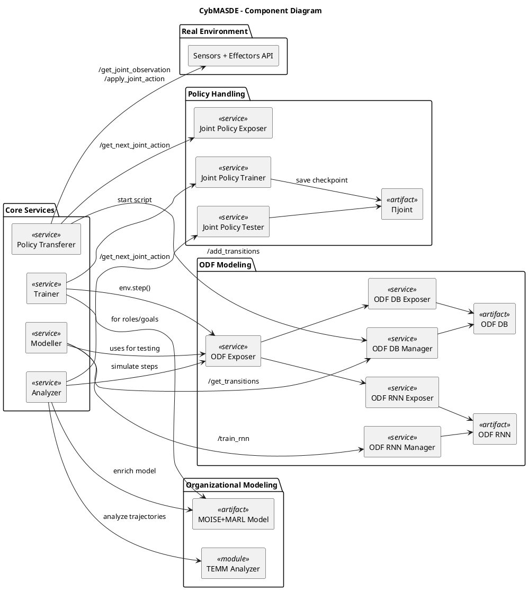

### Component Diagram

```plantuml

@startuml
title CybMASDE – Component Diagram

left to right direction
skinparam componentStyle rectangle

' ---------------------
'   ENVIRONMENT
' ---------------------
package "Real Environment" {
  component "Sensors + Effectors API" as RealEnv
}

' ---------------------
'   CORE SERVICES
' ---------------------
package "Core Services" {
  component "Policy Transferer" <<service>>
  component "Trainer" <<service>>
  component "Modeller" <<service>>
  component "Analyzer" <<service>>
}

' ---------------------
'   MODEL MANAGEMENT
' ---------------------
package "ODF Modeling" {
  component "ODF DB Manager" <<service>>
  component "ODF RNN Manager" <<service>>
  component "ODF Exposer" <<service>>
  component "ODF DB Exposer" <<service>>
  component "ODF RNN Exposer" <<service>>
  component "ODF DB" <<artifact>>
  component "ODF RNN" <<artifact>>
}

' ---------------------
'   POLICY MANAGEMENT
' ---------------------
package "Policy Handling" {
  component "Joint Policy Trainer" <<service>>
  component "Joint Policy Exposer" <<service>>
  component "Joint Policy Tester" <<service>>
  component "Πjoint" <<artifact>>
}

' ---------------------
'   ANALYSIS / DESIGN
' ---------------------
package "Organizational Modeling" {
  component "MOISE+MARL Model" <<artifact>>
  component "TEMM Analyzer" as TEMM <<module>>
}

' ---------------------
'   CONNECTIONS
' ---------------------

' Policy Transferer interactions
"Policy Transferer" --> RealEnv : /get_joint_observation\n/apply_joint_action
"Policy Transferer" --> "Joint Policy Exposer" : /get_next_joint_action
"Policy Transferer" --> "ODF DB Manager" : /add_transitions

' Modeller
"Modeller" --> "ODF DB Manager" : /get_transitions
"Modeller" --> "ODF RNN Manager" : /train_rnn
"Modeller" --> "ODF Exposer" : uses for testing
"ODF DB Manager" --> "ODF DB"
"ODF RNN Manager" --> "ODF RNN"

' Trainer
"Trainer" --> "Joint Policy Trainer" : start script
"Trainer" --> "ODF Exposer" : env.step()
"Trainer" --> "MOISE+MARL Model" : for roles/goals
"Joint Policy Trainer" --> "Πjoint" : save checkpoint

' Exposers
"ODF Exposer" --> "ODF DB Exposer"
"ODF Exposer" --> "ODF RNN Exposer"
"ODF DB Exposer" --> "ODF DB"
"ODF RNN Exposer" --> "ODF RNN"

' Analyzer
"Analyzer" --> "ODF Exposer" : simulate steps
"Analyzer" --> "Joint Policy Tester" : /get_next_joint_action
"Analyzer" --> TEMM : analyze trajectories
"Analyzer" --> "MOISE+MARL Model" : enrich model
"Joint Policy Tester" --> "Πjoint"

@enduml
```
