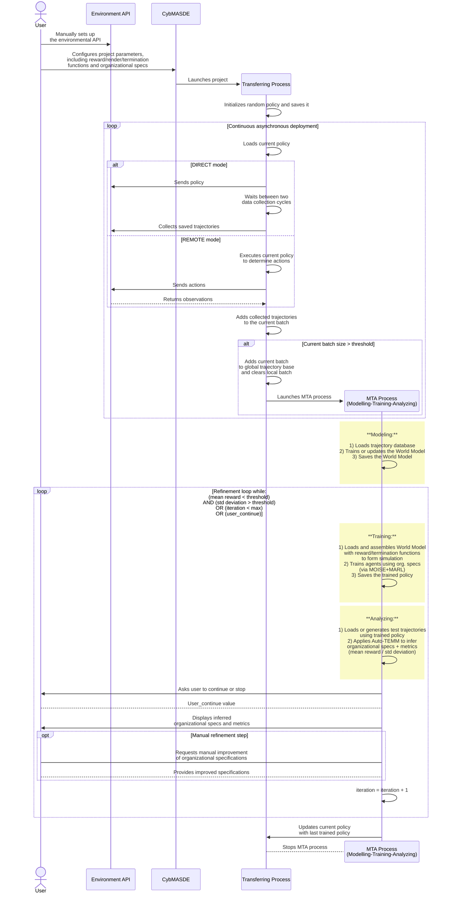

# Architecture

CybMASDE is designed as a **modular, extensible, and hybrid architecture** that unifies simulation, learning, analysis, and deployment in a coherent multi-agent development environment.

This section introduces:

* The **MAMAD conceptual framework**
* The **software modules** (Modeling, Training, Analyzing, Transferring, Refining)
* The **internal architecture** (backend, frontend, and CLI)
* The **process flow** between modules

---

## 🧠 1. Conceptual Overview: The MAMAD Framework

At the highest level, CybMASDE implements the **MAMAD methodology**:  
a structured process for developing intelligent multi-agent systems:

> **MAMAD**: *Modeling, Analyzing, Monitoring, Adapting, Deploying*

Each stage corresponds to a core subsystem in CybMASDE:

| Phase | Description | Key Components |
|--------|--------------|----------------|
| **Modeling** | Builds or learns an internal representation of the environment and organization. | Handcrafted or generated environments, world models (VAE, RNN) |
| **Training** | Learns agent policies through multi-agent reinforcement learning under MOISE+ constraints. | MAPPO, MADDPG, QMIX, ROMA |
| **Analyzing** | Evaluates and explains agent behaviors. | Auto-TEMM / TEMM analysis, clustering, metrics computation |
| **Transferring** | Deploys trained policies into real or hybrid environments. | API-based remote execution, trajectory synchronization |
| **Refining** | Adjusts or retrains the most relevant roles and goals based on analysis feedback. | Adaptive retraining, organizational updates |

Each phase is **autonomous but interconnected**, enabling iterative refinement cycles.

---

## 🧩 2. Software Architecture Overview

CybMASDE follows a **multi-layered architecture** composed of three main layers:

```

+-------------------------------------------------------+
|                   Frontend (Angular GUI)              |
|  - Project configuration editor                       |
|  - Visualization dashboards                           |
|  - Interactive pipeline control                       |
+-------------------------------------------------------+
|                   Backend (Python)                    |
|  - CLI interface (Click / Typer)                      |
|  - Core MAMAD modules (Modeling, Training, etc.)      |
|  - APIs and orchestration                             |
|  - Storage (JSON-based project state)                 |
+-------------------------------------------------------+
|                   Infrastructure Layer                |
|  - Python virtual environment                         |
|  - External libraries (PyTorch, Ray RLlib, etc.)      |
|  - API endpoints for remote environments              |
+-------------------------------------------------------+

```

### 🧮 Backend (Python)

The backend is the **core engine** of CybMASDE.  
It contains all algorithmic, data management, and orchestration logic.

Main responsibilities:

* Execute each activity of the MAMAD pipeline  
* Manage project state and configurations (`project_configuration.json`)  
* Provide the CLI and Python APIs  
* Handle data persistence, logging, and checkpointing  

Each submodule (e.g., `cybmasde.training` ) can be used **standalone** or through the main pipeline orchestrator.

---

### 🌐 Frontend (Angular)

The frontend provides a **graphical interface** for visualizing and editing project configurations.  
It communicates with the backend through IPC (if running as an Electron app) or REST endpoints (if hosted separately).

Key features:

* Step-by-step configuration of each MAMAD activity  
* JSON and code editor (Monaco) for advanced users  
* Interactive dashboards for training and analysis metrics (_upcoming feature_)
* Integrated file project management and validation tools
* Running the full pipeline from GUI interface

---

### 💻 CLI Interface

The Command Line Interface ( `cybmasde` ) is built using Python’s **Typer** library.  
It provides a consistent way to run the entire pipeline or individual modules.

Examples:

```bash
cybmasde init -n demo_project --template worldmodel
cybmasde validate
cybmasde run --full-auto
cybmasde analyze --auto-temm
cybmasde deploy --remote
```

The CLI acts as a **thin orchestration layer**, invoking the corresponding backend processes.

---

## ⚙️ 3. Internal Components

Each activity in CybMASDE corresponds to a Python module and is mapped to a specific section in the configuration file.

| Module           | Folder           | Core Responsibilities                                                          |
| ---------------- | ---------------- | ------------------------------------------------------------------------------ |
| **Common**       | `/common/` | Global project metadata, label manager, environment paths                      |
| **Modeling**     | `/modelling/` | Builds handcrafted or generated environments and trains the world model        |
| **Training**     | `/training/` | Optimizes agent policies using MARL algorithms with organizational constraints |
| **Analyzing**    | `/analyzing/` | Evaluates, visualizes, and explains learned behaviors                          |
| **Transferring** | `/transferring/` | Interfaces with external APIs to deploy policies and collect trajectories      |
| **Refining**     | `/refining/` | Performs iterative training-analysis cycles until stability or convergence     |

Each module has its own `__init__.py` and exposes a Python API compatible with the CLI entrypoints.

---

## 🔄 4. Process Flow

The typical **execution flow** (in automatic mode) looks like this:



The **MTA process** (Modeling-Training-Analyzing) runs asynchronously with the **Transferring process**, ensuring continuous learning and adaptation in hybrid environments.

---

## 🧰 5. Configuration System

CybMASDE projects are driven by a single JSON configuration file:

```
project_configuration.json
```

Each key corresponds to one module:

```json
{
  "common": { ... },
  "modelling": { ... },
  "training": { ... },
  "analyzing": { ... },
  "transferring": { ... },
  "refining": { ... }
}
```

This schema allows for:

* Automatic validation (`cybmasde validate`)
* Modular updates (partial reconfiguration)
* Reproducible experiments

---

## 🧠 6. Extensibility and Integration

CybMASDE is designed to be **extensible**:

* You can add new **learning algorithms** by subclassing the MARLlib `Trainer` base class.
* You can register new **analysis methods** (e.g., new metrics or visualization tools).
* You can plug in new **deployment targets** via REST APIs interfaces.

Developers can use the internal Python API to script or automate workflows without leaving their research environment.

---

## 🧮 7. Technology Stack

| Layer              | Technology                               | Description                                |
| ------------------ | ---------------------------------------- | ------------------------------------------ |
| **Backend**        | Python 3.8, Typer, PyTorch, RLlib      | Core learning, orchestration, and CLI      |
| **Frontend**       | Angular 18+, TypeScript, Material Design | GUI for configuration and visualization    |
| **Analysis**       | NumPy, Pandas, Matplotlib, Scikit-learn  | Data analysis and trajectory visualization |
| **Explainability** | Auto-TEMM, PCA, clustering               | Explainable MARL evaluation                |
| **Deployment**     | REST API, deployment loop     | Integration with external infrastructures  |

---

## 🚀 8. Summary

CybMASDE’s architecture merges:

* **The formalism of organizational modeling (MOISE+)**
* **The adaptivity of multi-agent reinforcement learning**
* **The usability of modern development tools (CLI, GUI, API)**

This unique combination enables the **design of distributed, explainable, and adaptive multi-agent systems** ready for both research and operational contexts.
