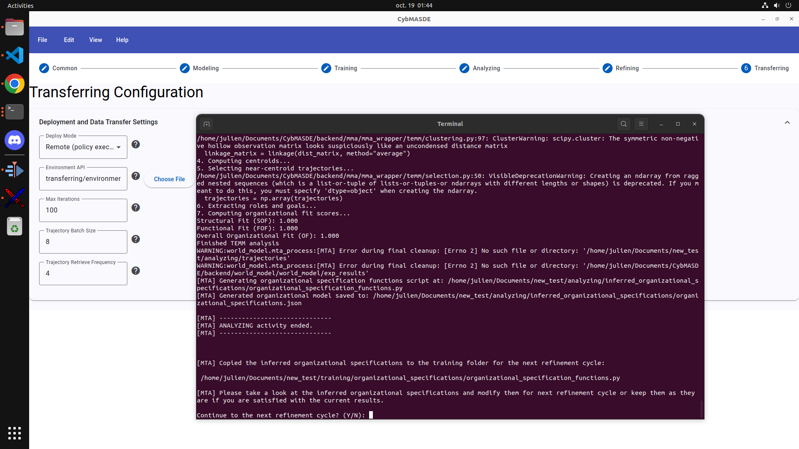

# CybMASDE - Graphical User Interface (GUI) Reference

The **CybMASDE Graphical Interface** provides a visual, user-friendly way to configure and run the entire MAMAD workflow (from *Modeling* to *Training*, *Analyzing*, *Refining*, and *Transferring*).  
It is designed for researchers and engineers who prefer graphical interactions over CLI scripting.

---

## 🚀 Launching the Interface

Once CybMASDE is installed, to launch the GUI make sure your environmental API (Overcooked-AI REST API complying with `environment_api.py` in the `transferring` folder in project) is running, then from the main project directory open two terminal tabs.

In the first tab, open the backend server:

```bash
cd backend
source env/bin/activate      # POSIX; use env\Scripts\activate on Windows
cd api_server
python server.py
```

In a second tab, open the frontend with:

```bash
cd frontend
npm run start
```

Then, an native-like desktop Electron window should appears.\
If nothing appears, you better check logs at opening your browser at: [http://localhost:4200](http://localhost:4200)

From there, you can:

* Create and edit project configurations visually, 
* Launch and monitor the transferring and mta processes, 
* Inspect Auto-TEMM analysis results interactively.
* ...

The interface will open in a desktop window (based on Electron or PyQt, depending on your build).
You should see the **home screen** similar to the one below.

---

## 🏠 Home Screen


The **Home Screen** is the starting point for all CybMASDE workflows. It provides quick access to project management and help resources.

### Sections

* **Start**

  + **New Project** – Create a new CybMASDE project with default folder structure and configuration files.
  + **Load a Project** – Open an existing project directory.
* **Recent Projects**

  + Displays the list of recently opened projects for quick access.
* **Help Panel**

  + Links to the official [Wiki](https://github.com/julien6/CybMASDE/wiki) and the YouTube tutorial.

---

## ⚙️ Common Configuration


This tab defines **global project parameters** shared across all stages.

### Fields

| Parameter               | Description                                                        |
| ----------------------- | ------------------------------------------------------------------ |
| **Project Name**        | Name of your current CybMASDE project                              |
| **Project Description** | Short text describing the experiment                               |
| **Label Manager Path**  | Path to your custom `label_manager.py` file                        |
| **Project Path**        | Root directory where all configurations and outputs will be stored |

---

## 🧩 Modeling Configuration


The **Modeling** tab allows you to define or generate your **world model**.
You can load existing models or trigger automatic world-model creation using VAEs and RNNs.

### Sections

* **Environment**

  + Define the structure of your simulated or handcrafted environment.
* **Generated Environment**

  + Choose between handcrafted and world-model-based generation.
* **World Model**

  + Configure **Joint Observation Prediction Model (JOPM)** and **Recurrent Dynamics Latent Model (RDLM)**.
* **Hyperparameters JSON**

  + Load or edit hyperparameters for VAE and RDLM optimization.
* **Output Metrics**

  + Observe metrics such as *Max MSE* for reconstruction performance.

---

## 🧠 Training Configuration


The **Training** tab configures the **Multi-Agent Reinforcement Learning (MARL)** phase.

### Sections

* **Hyperparameters JSON**

  + Edit training configuration directly as JSON (e.g., learning rate, PPO parameters, epochs).
* **Organizational Specifications**

  + Path to organizational rules and constraints (MOISE+).
* **Joint Policy**

  + Directory where trained policies will be stored.
* **Statistics**

  + Monitored metrics such as reward evolution and convergence speed.

Example configuration snippet (training hyperparameters):

```json
{
  "algorithms": {
    "mappo": {
      "lr": 0.0005,
      "clip_param": 0.3,
      "entropy_coeff": 0.01
    }
  }
}
```

---

## 📊 Analyzing Configuration


The **Analyzing** tab handles **Auto-TEMM** and **TEMM**-based trajectory analysis and explicability metrics.

### Sections

| Field                                      | Description                                      |
| ------------------------------------------ | ------------------------------------------------ |
| **Hyperparameters JSON**                   | Parameters for analysis methods and clustering   |
| **Figures Path**                           | Directory for generated analysis plots           |
| **Post-Training Trajectories**             | Folder containing trajectories from training     |
| **Inferred Organizational Specifications** | Folder containing inferred role/goal definitions |

Output metrics include:

* **Reward distributions**
* **Organizational fit (FOF, SOF)**
* **Stability and explainability indices**

---

## ♻️ Refining Configuration


The **Refining** tab manages iterative cycles that improve model performance and organizational coherence.

### Sections

| Parameter                     | Description                                                        |
| ----------------------------- | ------------------------------------------------------------------ |
| **Maximum Refinement Cycles** | Defines how many refinement loops are allowed                      |
| **Automatic Refinement**      | Enable *Auto-Continue* for continuous retraining until convergence |

Typical use:
After each analysis, inferred organizational specifications are re-injected into training to guide agent behavior improvements.

---

## 🌐 Transferring Configuration


The **Transferring** tab controls how CybMASDE interacts with real or simulated infrastructures.

### Sections

| Parameter                         | Description                                                     |
| --------------------------------- | --------------------------------------------------------------- |
| **Deploy Mode**                   | Select between *Remote* (via API) or *Direct* (local execution) |
| **Environment API**               | Path to your API interface script                               |
| **Max Iterations**                | Number of environment iterations                                |
| **Trajectory Batch Size**         | Number of trajectories collected before each analysis           |
| **Trajectory Retrieve Frequency** | Frequency of synchronization with the environment               |

Example:
Remote deployment can be used to interact with a Kubernetes or drone simulation API.

---

## ▶️ Running the Project

To execute the pipeline through the GUI, use the **menu bar**:

**File → Run Project**


This will launch the full **MAMAD process** (Modeling → Training → Analysis → Refinement → Transfer).
The logs are displayed in a terminal window integrated into the interface.

---

## 🧾 Example: Running and Refining a Project

### Running Example


### At a Refinement Step



During a refinement loop, the terminal prompts you:

```
Continue to the next refinement cycle? (Y/N)
```

You may accept ( `Y` ) to automatically proceed to the next loop or stop to manually review the resulting organizational specifications provided in `analyzing/inferred_organizational_specifications/organizational_specifications.json` also getting some help from visually rendered figures of trained agents' trajectories in `analyzing/figures` .

---

## 🎥 Video Tutorial

For a complete visual walkthrough of the GUI workflow (including project creation, configuration, training, and refinement) watch the following video:

📺 **[CybMASDE GUI - Full Project Demo (Overcooked-AI Example)](https://www.youtube.com/watch?v=WJ3Bf6irpx0)**
